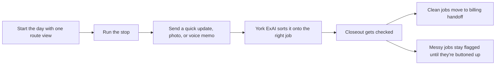
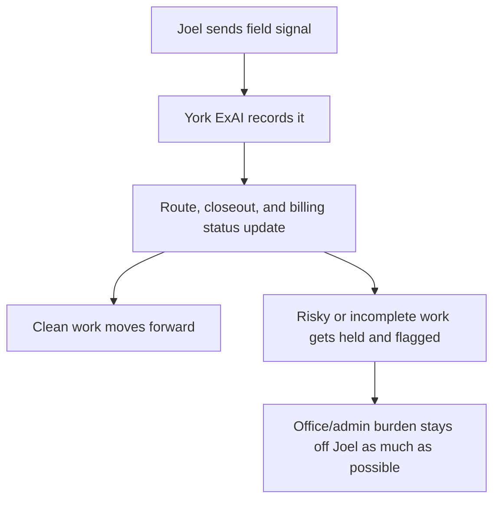
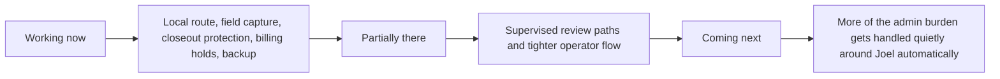

# York ExAI For Joel

This is what York ExAI is supposed to do for you.

It is not supposed to turn you into a software guy.

It is supposed to take the office drag, loose ends, and paperwork risk that pile up around the work you already know how to do, and keep that stuff from getting away from the business.

## What This Is

Think of this like a dependable office hand riding along with you.

You do the bug work.

The system is supposed to catch the route, the notes, the photos, the voice updates, the callbacks, the paperwork gaps, and the billing handoff without you having to stop and run a bunch of admin in the truck.

The point is simple:

- fewer missed details
- fewer callbacks falling through the cracks
- fewer jobs that feel done but are not really buttoned up
- less money waiting around because billing or paperwork is a mess
- less time trying to remember what happened three days later

## What It Should Fix

The business pain is not that you do not know pest control.

The pain is everything that stacks up around the work:

- route days getting scrambled
- urgent yellowjacket jobs blowing a hole in the schedule
- photos and notes living in too many places
- termite and bed bug work needing more follow-through than a normal stop
- callbacks muddying up what should or should not get billed
- end of day still feeling loose
- week and month end cleanup taking over

York ExAI is supposed to take that mess and keep it organized while the day is moving.

## What A Normal Day Should Feel Like

You should be able to start the day with one clean picture:

- where you are going
- what is urgent
- what is paperwork-heavy
- what is callback work
- what could hold up billing later

Then you go run jobs.

As you work, the system should be able to take quick field signal:

- short check-ins
- photos
- voice memos
- closeout notes

It should turn that into job truth without making you re-type the same thing over and over.

When a normal recurring job is done clean, it should move forward clean.

When something is not clean, the system should say so plain and keep it from being treated like finished work.

## When The Day Goes Sideways

That is where this should help the most.

If a yellowjacket job drops in, it should get added without hiding the termite or callback work that still matters.

If you send a voice memo and the system is not confident what job it belongs to, it should keep the audio and flag it for review instead of guessing.

If termite paperwork is not complete, it should not act like the job is done.

If bed bug prep was not there or follow-up is still needed, it should not fake a clean closeout.

If a job is a callback, it should stay tied to the callback path and not quietly slide into normal billing.

## End Of Day, End Of Week, End Of Month

By end of day, you should not be wondering what is still hanging out there.

The system should make it plain:

- what got done
- what is still unresolved
- what is blocked on paperwork
- what is ready to bill
- what is on hold because it was callback work or not truly closed

By end of week, it should help keep callbacks, loose invoices, and missing documentation from stacking up.

By end of month, it should help the business stop playing catch-up with records, unpaid work, and half-finished admin.

The goal is not more screens.

The goal is less cleanup.

## What Is Working Now

The current setup already proves some of the core protection pieces:

- a local route day can be created and kept ordered
- urgent inserts can be added without burying specialty work
- field check-ins, photos, and voice memos can be captured locally
- raw audio is kept even when the system needs review instead of guessing
- termite paperwork gaps can block clean closeout
- bed bug prep and follow-up state can stay explicit
- callback work can stay on a billing hold instead of being treated like clean revenue
- end-of-day reporting and local backup are in place

That means the backbone for route, field capture, closeout protection, and billing protection is real now.

## What Is Partially There Or Still Supervised

Some of the workflow is real, but still needs the system watched closely:

- voice memo extraction still needs careful review when the signal is weak
- blocked paperwork and hold logic are working, but the business process around them still needs steady discipline
- the core protection is there, but the fuller day-to-day operator experience is still being shaped

So the protection is there now, but the whole "it just runs the admin around Joel" experience is not fully finished yet.

## What Is Coming Next

The near-term direction is to make this feel less like a tool sitting beside the work and more like the work getting backed up automatically.

That means:

- smoother day-start route support
- easier field capture without typing
- stronger closeout packet handling
- tighter invoice handoff
- better follow-through on callbacks and loose ends
- more of the office side getting handled quietly in the background

## What You Should Expect From The System

You should expect it to:

- keep up with the route
- hold onto your field evidence
- stop incomplete work from looking complete
- keep callback work from getting sloppy
- make billing handoff cleaner
- give the office a better picture without dragging you into extra admin

You should not expect it to magically invent trade judgment or make regulated paperwork problems disappear.

If something is not buttoned up, the system should call it out, not cover it up.

## What The System Should Need From You

Not much.

What it needs is the field signal you already have:

- a quick status update
- a short voice memo
- a photo when it matters
- a blunt note when something is off

That should be enough for the system to keep the rest moving.

If York ExAI is doing its job right, you should feel more backed up and less dragged into cleanup work.
